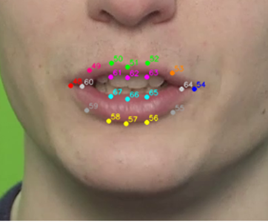
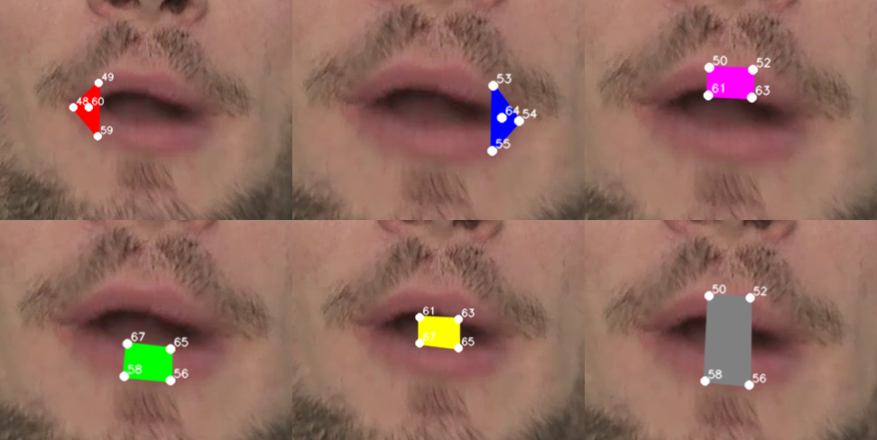

# Data Augmentation for AVSR

This repository contains the preprocessing, alignment, and augmentation workflows used for Audio Visual Speech Recognition experiments built around AV-HuBERT.

The repo is centered on three working areas:

- [timit_preperation](timit_preperation) for TCD-TIMIT preprocessing
- [lrs3_preperation](lrs3_preperation) for LRS3 preprocessing
- [augmentation](augmentation) for interpolation and smart blur experiments

## Environment setup

Two conda environments are documented in this repository:

- [augmentation/aligner_env.yml](augmentation/aligner_env.yml): minimal MFA-only environment for alignment runs.
- [avsr_aug.yml](avsr_aug.yml): preparation + augmentation environment (notebook and script workflows).

Create and activate the preparation/augmentation environment from the project root:

```powershell
conda env create -f avsr_aug.yml
conda activate avsr_aug
```

This environment is built from imports used in the preparation and augmentation workflows, including OpenCV, NumPy/Pandas/SciPy, SoundFile, tqdm, and MFA/TextGrid tooling.

## How the project flows

The usual path is: prepare a dataset, generate landmarks, crop a stable mouth ROI, then run augmentation on the prepared clips.

For the preprocessing stages, the media is first converted into model-friendly formats and then turned into mouth-centric inputs. The landmark step is what connects the full-face videos to the crop stage, and the crop stage is what produces the final AV-HuBERT-ready clips. The landmark visualization below shows the kind of point layout the cropper works from.



Once the base clips are ready, the augmentation notebooks introduce controlled temporal perturbations. Interpolation-based augmentation creates additional intermediate frames, while smart blur focuses on viseme or phoneme regions inside the clip.


After interpolation, the pipeline moves from global temporal changes to spatially focused modifications. In practice, this means selecting the most speech-relevant area of each frame and applying targeted augmentation where it has the highest impact on lip articulation cues. The mouth-region view below illustrates how these localized regions are defined before smart blur is applied.



## Where to start

If you are working on TCD-TIMIT, start in [timit_preperation/README.md](timit_preperation/README.md). If you are working on LRS3, start in [lrs3_preperation/README.md](lrs3_preperation/README.md). If you already have prepared clips and want to experiment with augmentation, go straight to [augmentation/README.md](augmentation/README.md).

## Typical workflow order

1. Run the relevant preprocessing notebook.
2. Check that the landmark and crop outputs look correct.
3. Run the augmentation notebooks on the prepared clips.
4. Compare training or evaluation results.

## Results

The table below summarizes a small set of representative LRS3 results: the two control runs first (baseline and AV-HuBERT image augmentation), followed by selected top-performing interpolation and viseme blur configurations.

| Run Type | WER | Relative Improvement |
| --- | ---: | ---: |
| No Augmentation | 4.11% | 0.00% |
| AV-HuBERT Image Augmentation | 4.02% | 2.09% |
| 200 ms Lag Interpolation | 3.76% | 8.48% |
| 100 ms Lag Interpolation | 3.88% | 5.60% |
| Viseme Blur Highest Visibility (B,C,D,E,F) - Word-Level | 3.83% | 6.76% |
| Low Visibility Viseme Blur (G,H,I,J,K) - Word-Level | 3.90% | 5.04% |

The repository also contains supporting scripts, notes, and diagrams outside these main workflow folders, but the three folders above are the intended entry points.

For a thesis-to-code cross-check of script names and implementation logic, see [Thesis/github_submission_traceability.md](Thesis/github_submission_traceability.md).


