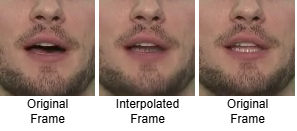
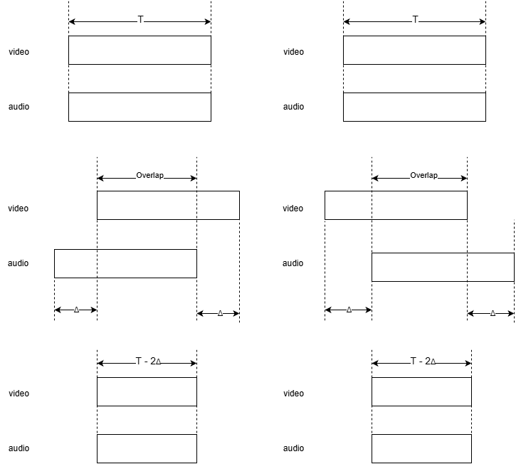
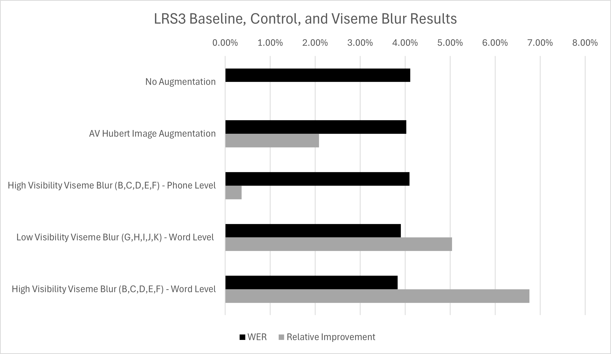
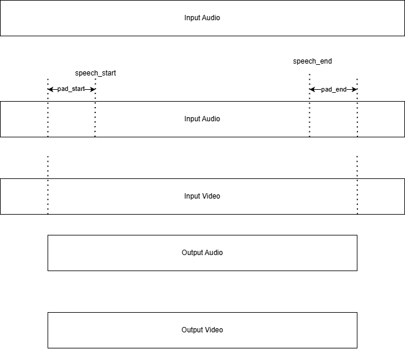

# Data Augmentation for AVSR

This repository contains preprocessing and augmentation workflows for Audio Visual Speech Recognition experiments built around AV-HuBERT.

The project is organized around three practical workflows:

1. TCD-TIMIT preparation
2. LRS3 preparation
3. Visual/audio augmentation experiments

## Repository structure

- TCD-TIMIT prep: [timit_preperation](timit_preperation)
- LRS3 prep: [lrs3_preperation](lrs3_preperation)
- Augmentation experiments: [augmentation](augmentation)
- Diagrams and visual notes: [figures](figures)

## End-to-end pipeline

1. Prepare dataset media
: Convert video and audio to model-friendly formats (for example 25 fps and 16 kHz mono).
2. Extract landmarks
: Generate face landmarks for each clip.
3. Generate mouth ROI clips
: Stabilize and crop around the mouth to produce model inputs.
4. Apply augmentation workflows
: Run lead/lag interpolation and smart blur experiments for robustness testing.

## Visual overview

## Folder-specific guides

- TCD-TIMIT guide: [timit_preperation/README.md](timit_preperation/README.md)
- LRS3 guide: [lrs3_preperation/README.md](lrs3_preperation/README.md)
- Augmentation guide: [augmentation/README.md](augmentation/README.md)

## Typical workflow order

1. Run TCD-TIMIT or LRS3 preprocessing notebook first.
2. Verify landmarks and ROI output quality.
3. Run augmentation notebooks on prepared clips.
4. Compare training/evaluation outputs.

## Notes

- The project includes research/experiment files beyond the core three folders.
- The three workflow folders above are the main maintained entry points.

