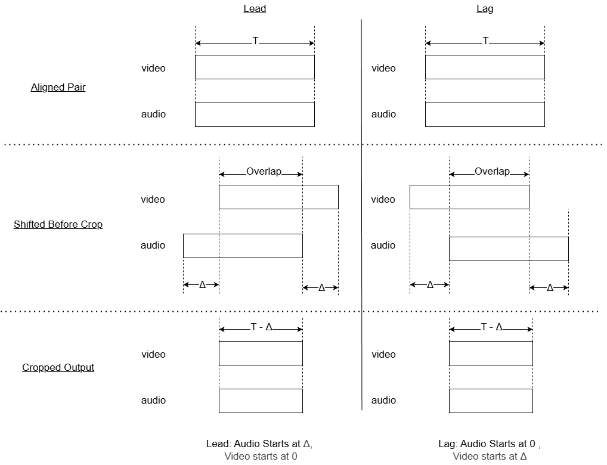
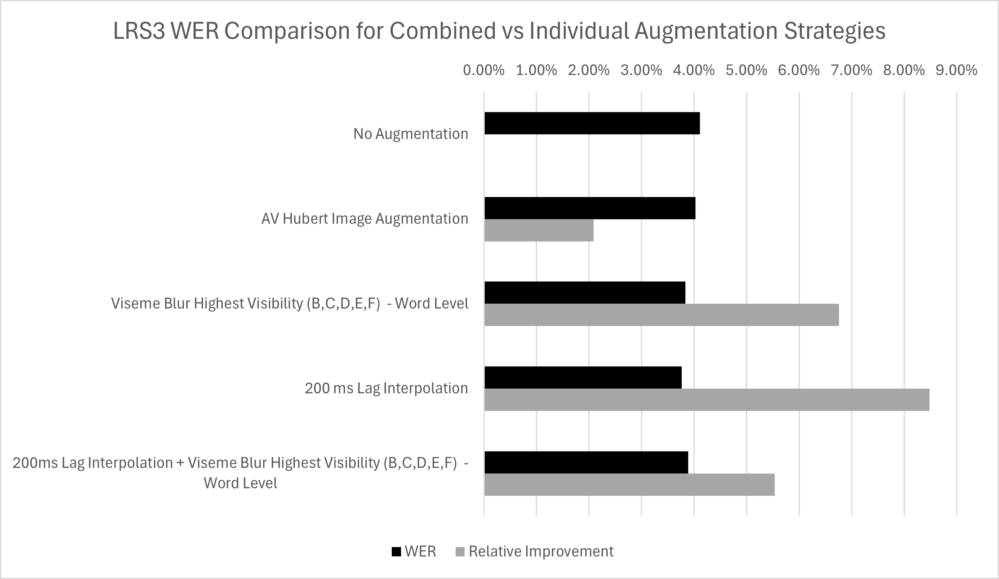

# Augmentation

This folder contains augmentation experiments applied after core dataset preprocessing.

## Files in this folder

- [interpolation_lead_lag.ipynb](interpolation_lead_lag.ipynb): TCD-TIMIT lead/lag interpolation workflow.
- [interpolation_lead_lag_lrs3.ipynb](interpolation_lead_lag_lrs3.ipynb): LRS3 lead/lag interpolation workflow.
- [smart_blur_notebook.ipynb](smart_blur_notebook.ipynb): TCD-TIMIT smart blur workflow.
- [smart_blur_notebook_lrs3.ipynb](smart_blur_notebook_lrs3.ipynb): LRS3 smart blur workflow.

## How the interpolation workflow works

1. Start from prepared 25 fps ROI/full-face videos.
2. Upsample each clip to 50 fps with motion interpolation.
3. Downsample to 25 fps using the mid-frame phase.
4. Realign audio to the new frame timeline.
5. Export aligned, lead, and lag variants.

The interpolation notebooks follow this same sequence for TCD-TIMIT and LRS3, with dataset-specific paths.

## How the smart blur workflow works

1. Select target viseme groups.
2. Choose span mode:
: word mode or phone mode.
3. Build or use alignment inputs (lab/TextGrid).
4. Map phonemes to viseme families.
5. Blur only selected temporal segments, keeping non-target segments intact.

## Figures

## Practical run order

1. Run either interpolation notebook for your dataset.
2. Validate output quality on a small speaker subset.
3. Run smart blur notebook with selected viseme groups.
4. Export augmented clips for training manifests.

## Scope boundaries

- Keep dataset conversion and landmark generation in [timit_preperation](../timit_preperation) and [lrs3_preperation](../lrs3_preperation).
- Keep this folder focused on augmentation methods only.
