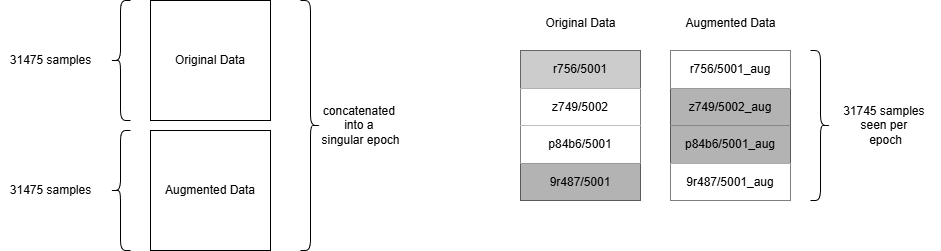
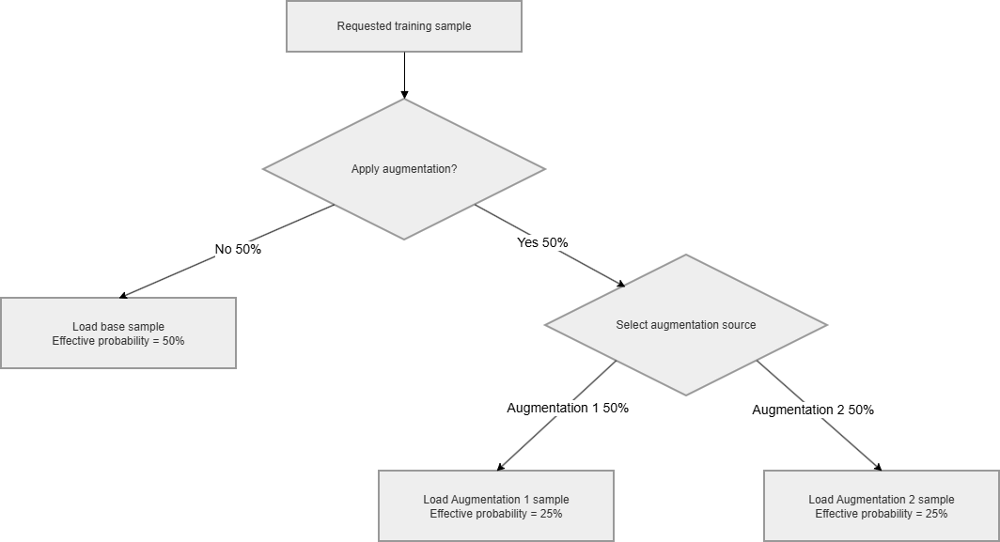

# AV-HuBERT Overrides

This folder contains local AV-HuBERT behavior overrides used to stabilize data loading and batching when mixing base and augmented samples.

## Batching fix summary

The batching fix was inspired by the way AV-HuBERT handles it's built in image and noise augmentation. If a singular data stimulis is to be augmented, it's augmented version is replaced with the original to keep the amount of data seen per epoch constant and no overlapping labels.

## Solution for including multiple augmentation conditions

1. A training request first decides whether augmentation is applied.
2. If augmentation is selected, one augmentation source is chosen.
3. Effective probabilities become:
: base sample 50%, augmentation source 1 sample 25%, augmentation source 2 sample 25%.

This makes the intended sampling distribution explicit and prevents accidental over/under-sampling of augmented data.

## Files in this folder

- [hubert_dataset.py](hubert_dataset.py): dataset loading override for batching/indexing behavior.
- [align_mouth_stabilised.py](align_mouth_stabilised.py): preprocessing override related to stabilized mouth crops.

