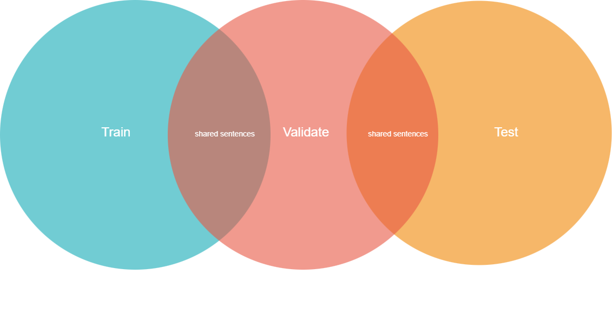

# LRS3 Preparation

This folder contains the LRS3 preprocessing workflow used before augmentation or model training.

## Files in this folder

- [lrs3_preprocessing.ipynb](lrs3_preprocessing.ipynb): clean LRS3 preprocessing notebook.
- [lrs3_mouth_crop.py](lrs3_mouth_crop.py): stabilized 96x96 mouth ROI batch wrapper.
- [align_lrs3_with_mfa.py](align_lrs3_with_mfa.py): Montreal Forced Aligner runner for TextGrid generation.
- [compare_wer_ttest.py](compare_wer_ttest.py): evaluation comparison helper with significance testing.

## Notebook flow

The notebook starts by configuring the split and optional speaker subset, then optionally converts the source media to 25 fps video and 16 kHz audio. That standardization step keeps the later landmark and crop stages simple.

The split structure matters here, because the preprocessing uses the dataset organization to decide which speaker folders to walk. The diagram below is the visual reminder of how the dataset is partitioned before alignment and cropping happen.

After the input structure is settled, the notebook extracts landmarks for the selected split and then crops stabilized mouth ROI clips from the matching video-landmark pairs.

## Alignment and blur readiness

If you need phone-level blur later, the alignment step is what makes that possible. The workflow is: generate lab text files if needed, run [align_lrs3_with_mfa.py](align_lrs3_with_mfa.py) to produce TextGrid alignments, and then feed those alignments into the augmentation notebooks for phone-span blurring.

## Mouth crop script behavior

[lrs3_mouth_crop.py](lrs3_mouth_crop.py) validates the directory structure, discovers speaker folders automatically, pairs clips by common file stem, runs stabilized mouth alignment/cropping with fixed parameters, and supports resume logic for long-running jobs.

The landmark layout below is the visual reference for the crop stage.

## Scope boundaries

- This folder is LRS3-specific.
- Augmentation method notebooks live in [augmentation](../augmentation).
- TCD-TIMIT-specific prep lives in [timit_preperation](../timit_preperation).
